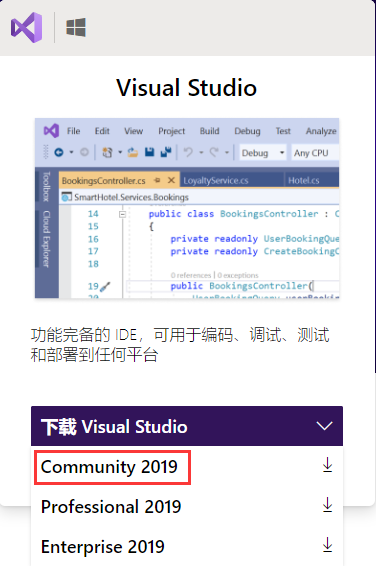
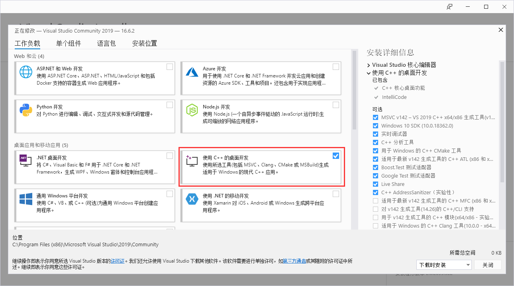
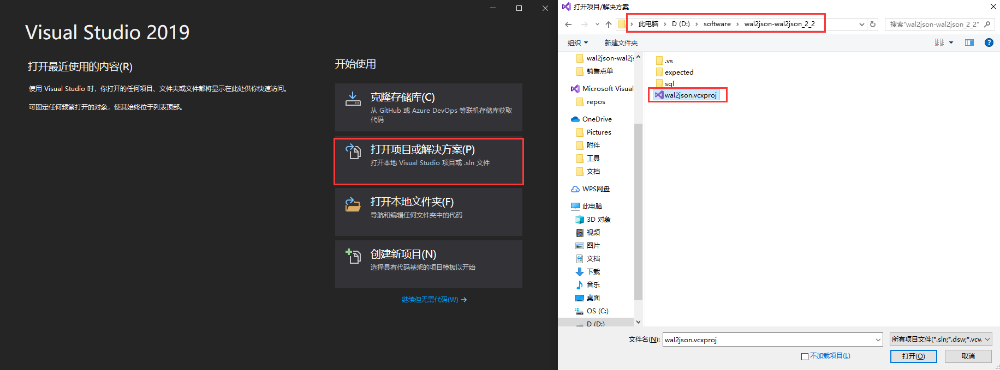
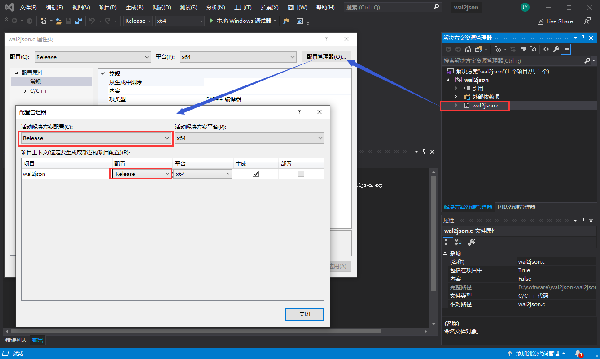
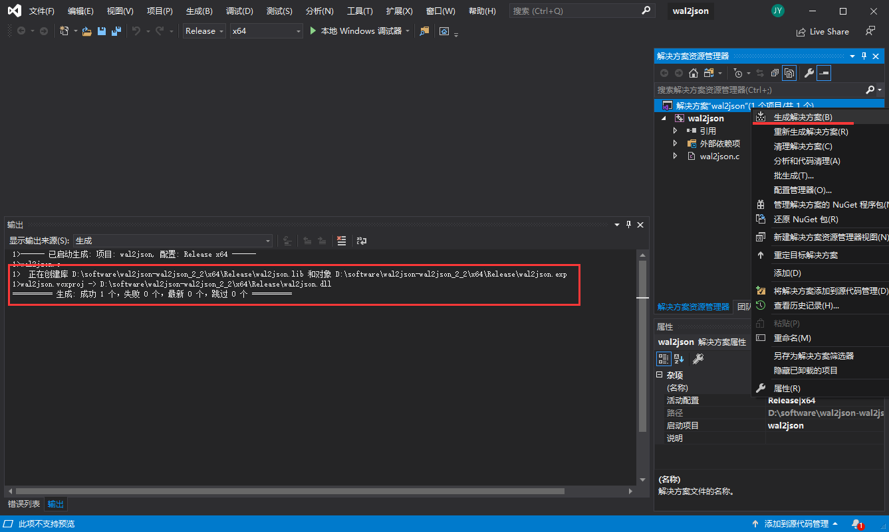
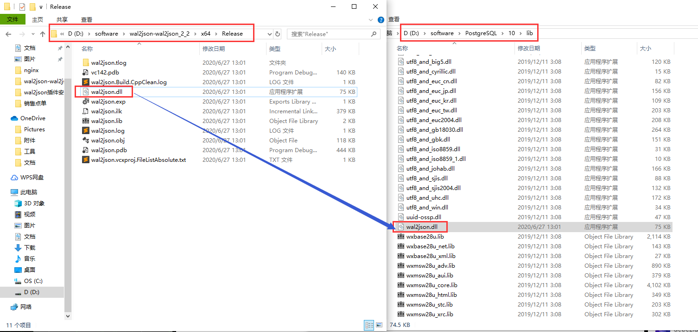

# 系统环境及软件版本

- window10 64位 系统
- postgresql 10 版本
- wal2json 2.2 版本(https://github.com/eulerto/wal2json/releases/tag/wal2json_2_2)
- Visual Studio 2019(https://visualstudio.microsoft.com/zh-hans/)


# 下载 wal2json 

根据上面地址下载 zip 文件，解压后打开 `wal2json.vcxproj` 文件,把文件中所有的 `c:\postgres\pg103` 替换成本地 postgresql 安装路径，如我本地 postgresql 路径 `D:\software\PostgreSQL\10`

# 下载 Visual Studio 2019 并编译 wal2json

postgresql 的安装与配置这里就不详细介绍了，可以自行搜索。所以文章是认为在本地已装过 postgresql 后进行安装 wal2json 插件。
由于 wal2json 插件在 window10 环境安装时需要进行编译。所以需要下载 Visual Studio 2019 进行编译 wal2json 插件。

- 根据上面地址下载 Visual Studio 2019, 选择Community 2019,下载下来的是 exe文件,执行exe文件。



- 根据提示进行安装，到下面这步时一定要选中 “使用 C++的桌面开发”



- 安装完成后导入 wal2json 项目文件



- 在 wal2json项目中 .c 文件上右键选择属性，把配置修改成 release， 包括配置管理器中的值



- 选择项目跟目录右键“生成解决方案”进行编译 wal2json，编译后会生成 dll 文件，文件的路径打印在控制台



- 将生成的 wal2json.dll 文件复制到 postgresql 的 lib 目录下



# 测试 wal2json 插件

- 在 postgresql 的 postgresql.conf 配置文件中增加如下配置，并重启数据库
```
wal_level = logical
```

- 打开一个命令窗口执行如下命令
```
$ pg_recvlogical -d postgres -U postgres --slot test_slot --create-slot -P wal2json
$ pg_recvlogical -d postgres -U postgres --slot test_slot --start -o pretty-print=1 -f -
```

- 再使用数据库连接工具，模拟新增、修改、删除数据
```sql
create table mstdata.test_slot(a serial8 primary key, b text, c float8, d timestamp);
insert into mstdata.test_slot (b, c, d) values ('test_slot', 11.11, now());
update mstdata.test_slot set b = 'test_slot1' where a = 2;
delete from mstdata.test_slot where a = 2;
```

- 第一个命令窗口打印出日志信息则说明 wal2json 插件运行正常


- 删除测试复制槽在第一个命令窗口执行
```
Ctrl+C
$ pg_recvlogical -d postgres -U postgres --slot test_slot --drop-slot
```

# 参考
- https://github.com/eulerto/wal2json
- https://blog.csdn.net/Kafka_yx/article/details/103240056